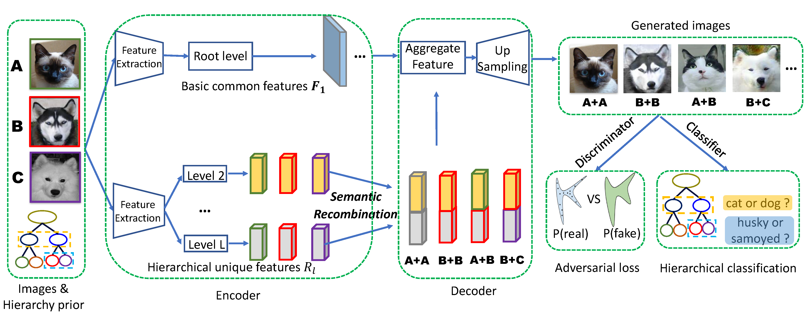

# HDN
Official Pytorch implementation of "Hierarchical disentangling network for object representation learning".

The framework of our proposed method HDN:



## Requirements

Please prepare the requirements by following the command.
```
pip install -r requirements.txt
```

## Train HDN models
### Prepare datasets
We use public benchmark datasets: a subset of CelebA, CADCars, Fashion MNIST and ShapeNet. We have preprocessed these four 
datasets and provided both the raw images and the annotations files for direct training and testing. You can 
download them from [Baidu Cloud Drive](https://pan.baidu.com/s/1kTD5MFVfeaFyXh_n0_sm6Q) using the extraction codes：ibcc.
In the future, we will provide a download link on Google Drive.

The training and testing settings on each dataset are shown in the configs folder, i.e., 
celeba.yaml, cadcars.yaml, fmnist.yaml and furniture.yaml. You should change some settings such as the 'model_name', 
 paths of files when training different models.


Examples
- Train the HDN model with CelebaA Hierarchical data.
- ```
  python train.py --config=./configs/celeba.yaml
  ``` 

- Train the HDN model with CADCars Hierarchical data.
- ```
  python train.py --config=./configs/cadcars.yaml
  ``` 

- Train the HDN model with Fashion MNIST Hierarchical data.
- ```
  python train.py --config=./configs/fmnist.yaml
  ``` 

- Train the HDN model with ShapeNet Hierarchical data.
- ```
  python train.py --config=./configs/furniture.yaml
  ``` 

## Evaluation
### Hierarchical feature extraction 
- ```
  python hier_fea_extraction.py --config=./configs/celeba.yaml --checkpoint=./outputs/model_name/checkpoints/gen_300000.pt --save_name feature_file_name
  ``` 
>>This operation will help you obtain the hierarchical disentangled features and hierarchical annotations of the test set in the format of .npz or .mat (Matlab).

### tSNE Visualization
- ```
  python tsne2d_vis.py --file_path=/path/to/feature file 
  ```
>>This operation will help you visualize the extracted features in 2D space. You should modify the evaluation codes to use combined features from different levels to obtain hierarchical discriminabilities.

### Image Manipulation
- ```
  python test_batch.py --config=./configs/celeba.yaml --checkpoint_gen=./outputs/model_name/checkpoints/gen_300000.pt --checkpoint_dis=./outputs/model_name/checkpoints/dis_300000.pt
  ```
>>This operation will help you obtain style transfer between image pairs via exchanging any level of disentangled features. Besides, it will compute the classificaiton accuracy of real and genearted images.
> You can also evaluate the Inception Score (IS), FID and LPIPS for the generated images using our provided IS.py and fid.py or the official LPIPS tools.

### Pretrained HDN models

We release our pretrained HDN models for reference on the [Baidu Cloud Drive](https://pan.baidu.com/s/1sjtE4WHCtUWm00n7XdVxAA) with extraction codes: ibcc.

## Contact
If you have any problem with our code, feel free to contact [shishi.qiao@vipl.ict.ac.cn](mailto:shishi.qiao@vipl.ict.ac.cn),
 [qiaoshishi@ouc.edu.cn](mailto:qiaoshishi@ouc.edu.cn)
or describe your problem in Issues.


